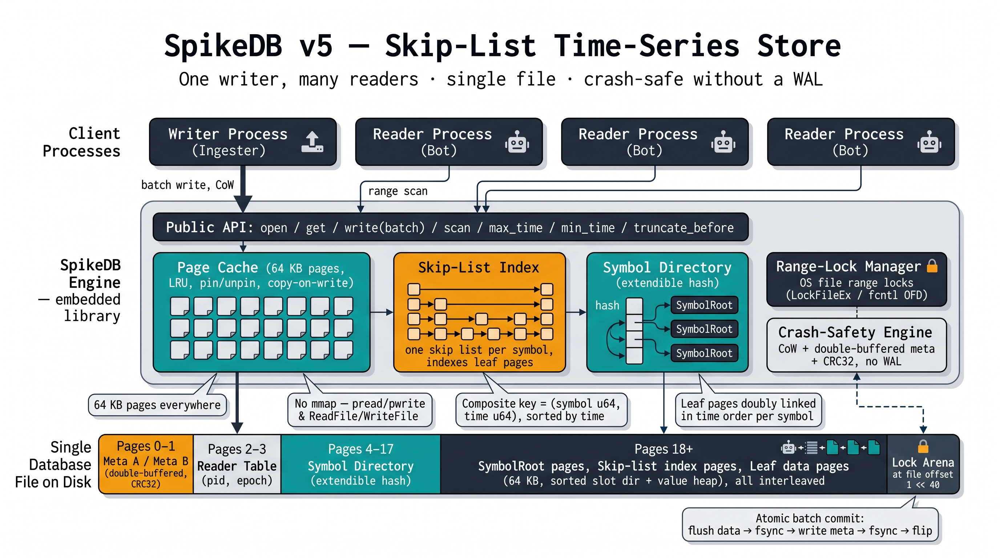

# SpikeDB

[](https://github.com/ZacWalk/spike-db/actions/workflows/ci.yml)



A single-file, embeddable, append-dominant time-series store for financial
market data. Composite primary key `(symbol_u64, time_u64, seq_u32)`,
sorted by `(time, seq)` within each `symbol`. Designed for one ingester
process and many concurrent reader processes (bots, training jobs,
dashboards).

> Status: pre-1.0. API stable in shape; on-disk format may still change
> until v1.0. **v7 added a per-page checksum trailer, optional fixed-width
> leaves and a wider leaf header; v6 added `seq` to the primary key. Older
> files are not readable.**

---

## Why SpikeDB?

Financial tick / candle data has a very specific shape that general-purpose
KV stores handle poorly:

- **Two-part composite key.** Every record is `(symbol, time)` and the
  natural query is "give me all of `BTCUSDT` between `t0` and `t1`."
- **Timestamps are not unique.** One aggressive order prints several
  fills under a single exchange nanosecond, so the key carries a `seq`
  tiebreaker rather than forcing the ingester to fudge timestamps.
- **Point-in-time reads.** "What was the last trade as of `T`?" is the
  basis of every feature pipeline and mark-to-market, and doing it wrong
  is how lookahead bias gets into a backtest.
- **Append-dominant, mostly time-ordered.** Live ticks arrive nearly sorted
  but can occasionally land out of order (network reordering, late fills).
- **One writer, many readers.** A single ingester writes; many bots and
  training pipelines stream the same data concurrently from other
  processes — sometimes hours-long range scans.
- **"Anything new since X?"** Every bot polls "what is the latest tick I
  have?" thousands of times per second. This must be effectively free.
- **Data gets corrected.** Exchanges bust trades and vendors restate
  bars, so the store needs overwrite and delete — and an ingest cursor
  that commits atomically with the data, or a restart leaves a gap.
- **Massive files.** Per-symbol per-year tick volumes run
  into hundreds of GB. Memory-mapping is not an option — it would either
  thrash the page cache or limit the file to RAM.

**Initial use case:** ingest live exchange tick streams into a single file,
train models off the same file across multiple processes, then run live
strategies against a continuously-updated copy in production.

---

## Quick example

```c
#include "spike_db.h"

SpikeDB* db;
spike_db_open(&db, "ticks.spdb", /* cache pages 64 KB */ 1024, 0);

/* Ingest a batch of ticks atomically */
SpikeDB_Batch* b = spike_db_batch_create();
for (int i = 0; i < n_ticks; i++) {
    spike_db_batch_put(b, ticks[i].symbol, ticks[i].time_ns,
                       &ticks[i].payload, sizeof(ticks[i].payload));
}
spike_db_write(db, b);   /* atomic; either all commit or none */
spike_db_batch_destroy(b);

/* "Anything new since I last looked?" — single page read, no I/O */
uint64_t latest;
spike_db_max_time(db, BTCUSDT, &latest);

/* Point-in-time: what was the last trade as of the bar close? */
void* v; size_t vlen; uint64_t as_of_t;
if (spike_db_get_le(db, BTCUSDT, bar_close_ns, &as_of_t, NULL, &v, &vlen) == SPIKEDB_OK) {
    mark_to_market(v, vlen);
    spike_db_free(v);
}

/* Stream the latest 60 seconds */
SpikeDB_Iter* it = spike_db_scan(db, BTCUSDT,
                                 latest - 60ULL * 1000000000ULL, latest);
uint64_t t;
const void* val;
size_t len;
while (spike_db_iter_next(it, &t, &val, &len)) {
    process_tick(t, val, len);
}
spike_db_iter_close(it);

spike_db_close(db);
```

---

## Design in one page

```
              ┌───────────── file ─────────────┐
              │  Pages 0..1   Meta A / Meta B  │  double-buffered, CRC32
              │  Pages 2..17  Symbol directory │  open-addressing hash → SymbolRoot
              │  Pages 18..   Skip-list nodes  │
              │               + Leaf pages     │
              │               + Free-list      │
              └────────────────────────────────┘
```

- **64 KB pages** everywhere, with an explicit page cache over
  `pread` / `ReadFile`. **No `mmap`**, so files can grow far beyond RAM.
- **One skip list per symbol**, indexing *leaf pages* rather than
  individual records. Leaves also form a doubly-linked list in time order,
  so a range scan is one `O(log N)` descent followed by a sequential walk.
- **Leaf page** = header + `(time, seq)`-sorted slot directory growing up +
  value heap growing down. Values live in the leaf; the maximum value is
  65000 B.
- **Per-symbol root page** caches `min_time` / `max_time` / `record_count`,
  so "what is the latest tick?" is a single warm cache hit.
- **Merged replay** across a watchlist is a heap over per-symbol cursors,
  so a backtest gets one globally time-ordered event stream without
  running N iterators.
- **Double-buffered, CRC-checked meta pages** publish a commit with a
  single atomic pointer flip, so a crash never yields a half-written
  index. See the crash-safety caveat under [Status](#status): a commit
  interrupted *mid-flush* is not yet atomic.
- **Every page is checksummed** (CRC-32C in a 4-byte trailer), so a torn
  or bit-rotted page is rejected on read instead of returning a wrong
  price. `spike_db_verify` walks the whole file for structural damage.
- **Multi-process safe** via an OS file range lock — shared for readers,
  exclusive for writers. Scans read a chunk at a time and can drop the
  lock in between, so an hours-long reader does not stall the ingester.

Full details — on-disk structures, algorithms, transaction and cache
internals, rationale, and known gaps — are in
**[docs/design.md](docs/design.md)**.

---

## API

```c
/* open / close */
SpikeDB_Status spike_db_open (SpikeDB** out, const char* path,
                              uint32_t cache_pages_64k, uint32_t flags);
void           spike_db_close(SpikeDB* db);

/* point lookup */
SpikeDB_Status spike_db_get    (SpikeDB* db, uint64_t symbol, uint64_t time,
                                void** value_out, size_t* len_out);
SpikeDB_Status spike_db_get_seq(SpikeDB* db, uint64_t symbol, uint64_t time,
                                uint32_t seq,
                                void** value_out, size_t* len_out);
/* as-of: latest record at or before `time`; get_ge is the mirror image */
SpikeDB_Status spike_db_get_le (SpikeDB* db, uint64_t symbol, uint64_t time,
                                uint64_t* time_out, uint32_t* seq_out,
                                void** value_out, size_t* len_out);
SpikeDB_Status spike_db_get_ge (SpikeDB* db, uint64_t symbol, uint64_t time,
                                uint64_t* time_out, uint32_t* seq_out,
                                void** value_out, size_t* len_out);
void           spike_db_free   (void* ptr);

/* atomic batch */
SpikeDB_Batch* spike_db_batch_create (void);
void           spike_db_batch_destroy(SpikeDB_Batch* b);
void           spike_db_batch_clear  (SpikeDB_Batch* b);
size_t         spike_db_batch_count  (const SpikeDB_Batch* b);
SpikeDB_Status spike_db_batch_put    (SpikeDB_Batch* b,
                                      uint64_t symbol, uint64_t time,
                                      const void* value, size_t len);
SpikeDB_Status spike_db_batch_put_seq(SpikeDB_Batch* b,
                                      uint64_t symbol, uint64_t time,
                                      uint32_t seq,
                                      const void* value, size_t len);
/* SPIKEDB_PUT_OVERWRITE replaces instead of rejecting (restatements,
   busted trades, idempotent replay) */
SpikeDB_Status spike_db_batch_put_ex (SpikeDB_Batch* b,
                                      uint64_t symbol, uint64_t time,
                                      uint32_t seq,
                                      const void* value, size_t len,
                                      uint32_t flags);
SpikeDB_Status spike_db_batch_del    (SpikeDB_Batch* b, uint64_t symbol,
                                      uint64_t time, uint32_t seq);
/* ingest cursor, committed in the same transaction as the data */
SpikeDB_Status spike_db_batch_put_meta(SpikeDB_Batch* b, const char* key,
                                       const void* value, size_t len);
SpikeDB_Status spike_db_get_meta      (SpikeDB* db, const char* key,
                                       void** value_out, size_t* len_out);
SpikeDB_Status spike_db_write        (SpikeDB* db, SpikeDB_Batch* b);
/* SPIKEDB_WRITE_NOSYNC: ordered and atomic, durable to the OS not the platter */
SpikeDB_Status spike_db_write_ex     (SpikeDB* db, SpikeDB_Batch* b,
                                      uint32_t flags);

/* range scan */
SpikeDB_Iter*  spike_db_scan         (SpikeDB* db, uint64_t symbol,
                                      uint64_t time_lo, uint64_t time_hi);
/* SPIKEDB_SCAN_NONBLOCKING: drop the reader lock between chunks so a long
   scan never stalls the ingester (read-committed instead of stable)
   SPIKEDB_SCAN_REVERSE: newest to oldest, for "the last N ticks" */
SpikeDB_Iter*  spike_db_scan_ex      (SpikeDB* db, uint64_t symbol,
                                      uint64_t time_lo, uint64_t time_hi,
                                      uint32_t flags);
bool           spike_db_iter_next    (SpikeDB_Iter* it, uint64_t* time_out,
                                      const void** value_out, size_t* len_out);
bool           spike_db_iter_next_seq(SpikeDB_Iter* it, uint64_t* time_out,
                                      uint32_t* seq_out,
                                      const void** value_out, size_t* len_out);
/* bulk form for replay loops */
size_t         spike_db_iter_next_batch(SpikeDB_Iter* it,
                                        SpikeDB_Rec* out, size_t max);
void           spike_db_iter_close   (SpikeDB_Iter* it);
SpikeDB_Status spike_db_iter_seek    (SpikeDB_Iter* it, uint64_t time,
                                      uint32_t seq);

/* merged replay: several symbols as one time-ordered stream */
SpikeDB_Iter*  spike_db_scan_multi     (SpikeDB* db,
                                        const uint64_t* symbols, size_t count,
                                        uint64_t time_lo, uint64_t time_hi,
                                        uint32_t flags);
bool           spike_db_iter_next_multi(SpikeDB_Iter* it, uint64_t* symbol_out,
                                        uint64_t* time_out, uint32_t* seq_out,
                                        const void** value_out, size_t* len_out);

/* hot polling helpers (single cached page read each) */
SpikeDB_Status spike_db_max_time(SpikeDB* db, uint64_t symbol, uint64_t* out);
SpikeDB_Status spike_db_min_time(SpikeDB* db, uint64_t symbol, uint64_t* out);
SpikeDB_Status spike_db_count   (SpikeDB* db, uint64_t symbol, uint64_t* out);
/* all of the above in one lock acquisition */
SpikeDB_Status spike_db_symbol_info(SpikeDB* db, uint64_t symbol,
                                    SpikeDB_SymbolInfo* out);
/* whole watchlist in one lock acquisition */
SpikeDB_Status spike_db_max_times  (SpikeDB* db, const uint64_t* symbols,
                                    uint64_t* times_out, size_t count);
/* global change token: skip all per-symbol work when nothing committed */
SpikeDB_Status spike_db_txn_id     (SpikeDB* db, uint64_t* out);
SpikeDB_Status spike_db_list_symbols(SpikeDB* db, uint64_t* out, size_t cap,
                                     size_t* count_out);

/* retention and corrections */
SpikeDB_Status spike_db_truncate_before(SpikeDB* db, uint64_t symbol,
                                        uint64_t time_exclusive);
SpikeDB_Status spike_db_delete_range   (SpikeDB* db, uint64_t symbol,
                                        uint64_t time_lo, uint64_t time_hi);
SpikeDB_Status spike_db_symbol_drop    (SpikeDB* db, uint64_t symbol);

/* fixed-width symbols: columnar leaves, one memcpy per leaf on read */
SpikeDB_Status spike_db_symbol_define(SpikeDB* db, uint64_t symbol,
                                      uint32_t record_size);
SpikeDB_Status spike_db_read_range   (SpikeDB* db, uint64_t symbol,
                                      uint64_t time_lo, uint64_t time_hi,
                                      void* dst, size_t dst_records,
                                      size_t* count_out);

/* operations */
SpikeDB_Status spike_db_wait_for_txn(SpikeDB* db, uint64_t last_seen,
                                     uint32_t timeout_ms, uint64_t* out);
SpikeDB_Status spike_db_prefetch    (SpikeDB* db, uint64_t symbol,
                                     uint64_t time_lo, uint64_t time_hi);
SpikeDB_Status spike_db_backup      (SpikeDB* db, const char* dest_path);
SpikeDB_Status spike_db_sync        (SpikeDB* db);

/* diagnostics */
const char* spike_db_strerror  (SpikeDB_Status status);
void        spike_db_last_error(SpikeDB* db, SpikeDB_Error* out);
void        spike_db_stats     (SpikeDB* db, SpikeDB_Stats* out);
/* full structural check: leaf chains, ordering, counters, index, free list */
SpikeDB_Status spike_db_verify (SpikeDB* db, SpikeDB_VerifyReport* out);
```

**Return codes:** `SPIKEDB_OK` (0), `SPIKEDB_NOT_FOUND` (-1),
`SPIKEDB_ERROR` (-2), `SPIKEDB_FULL` (-3), `SPIKEDB_CORRUPT` (-4),
`SPIKEDB_INVAL` (-5).

**Open flags:** `SPIKEDB_OPEN_READONLY`.

**Semantics worth noting:**

- `(symbol, time, seq)` is unique. Inserting the same triple twice
  is rejected with `SPIKEDB_INVAL`; the entire offending batch is rolled
  back atomically. `spike_db_batch_put` / `spike_db_get` imply `seq = 0`.
  Use `spike_db_batch_put_ex` with `SPIKEDB_PUT_OVERWRITE` for
  corrections and for idempotent replay after an ambiguous crash.
- Deleting a key that is not present is a no-op, not an error.
- Entries in one batch that touch the same key apply in submission
  order, so with `SPIKEDB_PUT_OVERWRITE` the last one wins.
- `spike_db_batch_put` accepts entries in any order. The engine sorts
  them by `(symbol, time, seq)` before applying.
- `spike_db_write` does not clear the batch — call `spike_db_batch_clear`
  before reusing it.
- The pointer returned in `*value_out` from `spike_db_iter_next` is owned
  by the iterator and is valid only until the next `iter_next` /
  `iter_close` call. `spike_db_get` returns a `malloc`'d buffer that the
  caller must release with `spike_db_free`.
- `spike_db_scan` holds the shared reader lock for the iterator's whole
  lifetime, so it blocks writers until closed — use it only for short
  scans. `spike_db_scan_ex` with `SPIKEDB_SCAN_NONBLOCKING` releases the
  lock between chunks; the scan is then read-committed rather than a
  stable snapshot.
- Maximum value length is 65000 bytes (a value must fit in a leaf with
  room for at least its own slot directory entry).
- Close every iterator before the handle it came from. An iterator
  borrows the `SpikeDB*` and holds a file lock; the library does not
  track open iterators, so closing the handle first is undefined
  behavior.
- A `SpikeDB*` handle is not thread-safe; use one handle per thread.
  Multiple handles and multiple processes on the same file are safe.

---

## Building

Single-file C11 implementation; the only dependencies are libc and the
OS file APIs. The build is CMake + Ninja, driven by one script:

```powershell
./dd.ps1 run            # build Release and run the suite  (default command)
./dd.ps1 build          # build only
./dd.ps1 run -Arch AVX512 -Config Debug
./dd.ps1 audit          # build with the structural audit hook, then run
./dd.ps1 asan           # AddressSanitizer + UBSan
./dd.ps1 lowmem         # 16- and 32-page cache passes
./dd.ps1 all            # everything above
./dd.ps1 clean
./dd.ps1 help
```

The same script runs on Linux and in WSL under `pwsh`. On Windows it finds
Visual Studio itself (including the 2026 layout, year directory `18`) and
imports the MSVC environment, because Ninja drives `cl.exe` directly and
needs it; `cmake` and `ninja` are taken from the VS install when they are
not on `PATH`.

To build against the library directly, `src/spike_db.c` plus `src/spike_db.h`
is the whole of it — `spike_db_internal.h` exists only for the test suite.

---

## Performance

100k records of 64 B each (single-process, warm cache, 32 MB cache pool):

| Platform                | Ingest        | Scan (warm)   | Pages used |
|-------------------------|---------------|---------------|------------|
| Windows MSVC AVX2       | ~2.0 M rec/s  | ~80 M rec/s   | 149        |
| WSL GCC AVX2 (`/mnt/c`) | ~530 K rec/s  | ~38 M rec/s   | 149        |

`spike_db_max_time` is a single cached page read once the per-symbol root
page is warm. Sorted ingest takes a tail-append fast path that skips the
skip-list descent entirely — on this benchmark that is 406k page pins
instead of 1.98M.

---

## Status

All of the above is implemented and covered by the test suite. Known gaps
(read-ahead, snapshot isolation, compaction, direct I/O) are listed in
[docs/design.md](docs/design.md). Note in particular that
`SPIKEDB_SCAN_NONBLOCKING` gives read-committed scans, not snapshots.

**Crash safety is not yet complete.** A commit publishes atomically via the
meta flip, but the page writes that precede the flip go to *pre-existing*
pages in place. If the process dies, or an I/O error occurs, after some of
those writes have landed and before the flip, the file can be left
internally inconsistent — `spike_db_verify` will report it, and the next
successful commit repairs it, but a batch is not all-or-nothing under a
power cut. Closing this needs an undo/redo log and therefore a format
change; it is the top item in [docs/testing.md](docs/testing.md) §6.
Until then, treat SpikeDB as a store whose system of record is upstream
(the exchange, the vendor file) and use the transactional ingest cursor
(`spike_db_batch_put_meta`) to resume after a restart.

